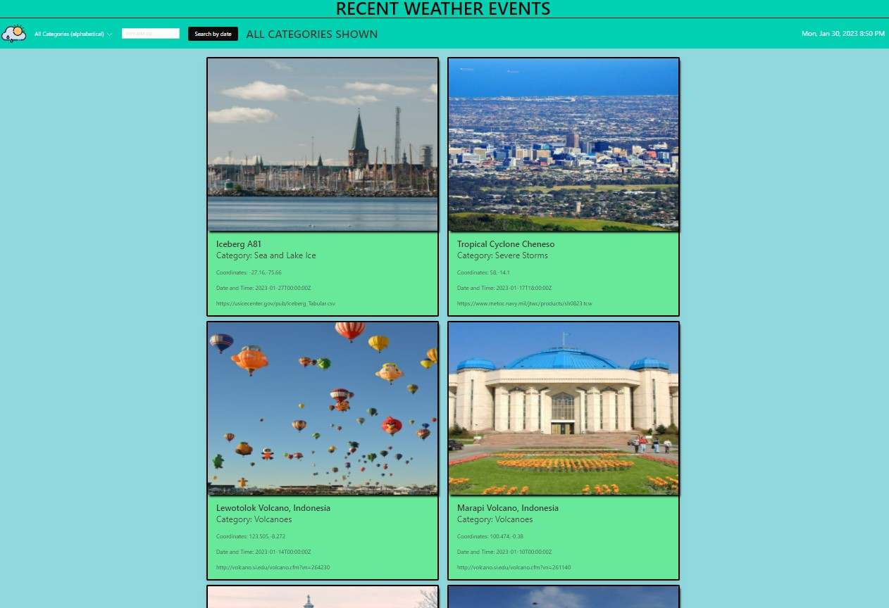

## Current Weather Events

This web application allows the user to search for weather events happening around the world! The user will land on a page with the most recent natural weather events from all over the world. If the user would like to search by category, they can enter into the search bar or select from the dropdown list of categories. Their searches will be stored in client side storage for future reference.

For example, if someone is visiting Alaska, they can select the category of ‘Volcanoes’ to see the latest (active) events, and the event details.

[Recent Weather Events Web Application](https://Ross-Boughman.github.io/weather-event-tracker/)

- The landing page list the most recent 10 weather events
- Search weather events by categories (search bar or category)
- Weather event location (coordinates), date & time, relevant link (.tcw file or website)
- Home button returns to landing page

The following are used by this application:

- [Bulma CSS Library](https://bulma.io/)

- [NASA: EONET](https://eonet.gsfc.nasa.gov/docs/v2.1)

- [Teleport](https://developers.teleport.org/api/getting_started/#photos_ua)

In local storage, there are the recent weather events are being stored. 

One of our biggest challenges was working together on this repo. Each of us had no experience prior to this project with working on branches and merging them into a main repo. We all asked each other questions and communicated what changes we were individually making so that the impact to the group's collective work merge well!