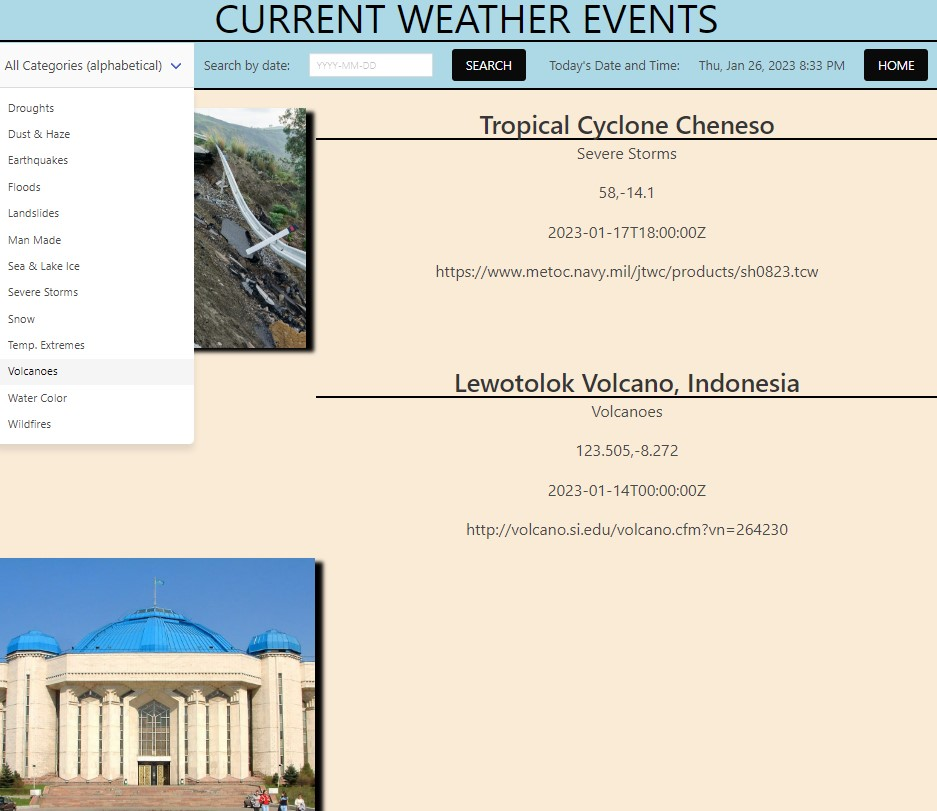

## Current Weather Events

This web application allows the user to search for weather events happening around the world! The weather events have categories and can be searched by date of occurance. 

[Current Weather Events Web Application](https://Ross-Boughman.github.io/weather-event-tracker/)

The CSS Library Balma is used for styling and the following are two 3rd party APIs accessed by the application:

- [NASA: EONET](https://eonet.gsfc.nasa.gov/docs/v2.1)

- [Teleport](https://developers.teleport.org/api/getting_started/#photos_ua)

In local storage, there are the recent weather events being stored. 

One of our biggest challenges was working together on this repo. Each of us had no experience prior to this project with working on branches and merging them into a main repo. We all asked each other questions and communicated what changes we were individually making so that the impact to the group's collective work merge well!